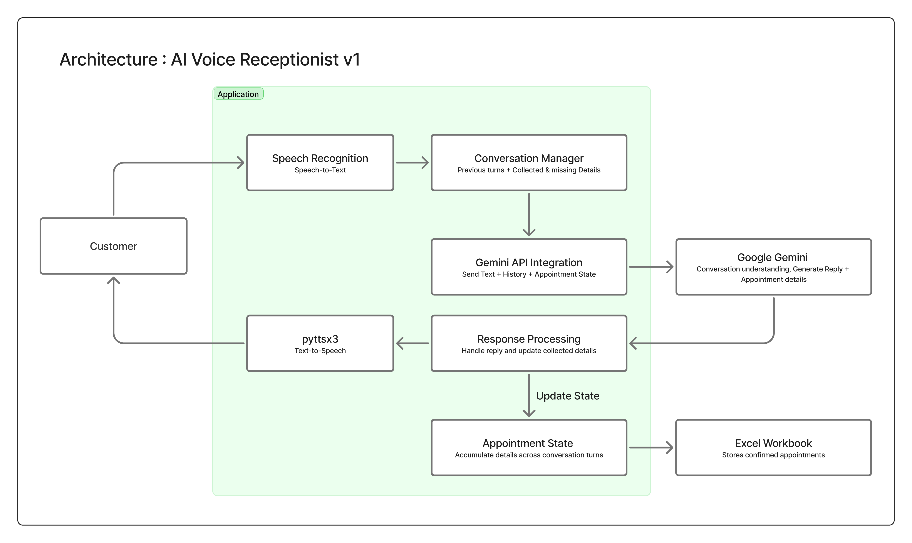

# Voice Receptionist V1

A Python-based voice AI receptionist prototype for a pet grooming business. The system uses Google Gemini to manage conversations, SpeechRecognition for voice input, and text-to-speech to interact with customers. It collects appointment details conversationally and stores confirmed bookings in an Excel workbook.

## Overview

Voice Receptionist V1 is a voice-first appointment booking assistant developed for pet grooming business.

Instead of requiring customers to provide all appointment information at once, the receptionist collects the required details conversationally, asking for missing information one question at a time.

The system maintains the information collected during the conversation, uses Google Gemini to interpret the customer's responses, and extracts the appointment information into a structured format.

Once all required information has been collected and the appointment is confirmed, the booking is saved to an Excel workbook.

This project is currently a local prototype and serves as the foundation for a more advanced AI receptionist system.

---

## System Architecture

The application follows a voice-to-AI-to-storage pipeline. The Python application manages the conversation, communicates with Google Gemini, processes appointment information, and stores confirmed appointments in an Excel workbook.

<p align="center">
  
</p>

## Features

- Voice-based customer interaction
- Speech-to-text using SpeechRecognition
- Conversational responses powered by Google Gemini
- Text-to-speech using pyttsx3
- Collects appointment information one field at a time
- Maintains information throughout the conversation
- Handles multiple pieces of information provided in a single response
- Extracts appointment information into structured JSON
- Confirms appointment details before saving
- Stores completed appointments in an Excel workbook
- Individual test scripts for Gemini, voice input/output, data extraction, and Excel operations
- Environment variable support for API credentials

---

## Appointment Information

The receptionist currently collects the following information:

| Field | Description |
|---|---|
| `customer_name` | Name of the customer |
| `pet_name` | Name of the pet |
| `breed` | Breed of the pet |
| `whatsapp` | Customer's WhatsApp number |
| `appointment_date` | Requested appointment date |
| `appointment_time` | Requested appointment time |

The receptionist is designed to collect these fields conversationally rather than asking for everything in a single question.

For example, if a customer provides both their name and their pet's name in the same response, the system can retain both pieces of information and continue by asking only for the remaining details.

---

## Conversation Flow

The general flow of the application is:

```text
Customer speaks
       |
       v
Speech Recognition
       |
       v
Text input
       |
       v
Google Gemini
       |
       +----> Conversation understanding
       |
       +----> Appointment information extraction
       |
       v
Assistant response
       |
       v
Text-to-Speech
       |
       v
Customer hears response
       |
       v
Appointment completed
       |
       v
Excel workbook
```

The application maintains the conversation history so that previously provided information can be used in subsequent interactions.

---

## Example Conversation

```text
AI: Hi, I'd be happy to help you book a grooming appointment.
    May I have your name?

User: My name is Lokesh.

AI: What is your pet's name?

User: Bruno.

AI: What breed is Bruno?

User: Golden Retriever.

AI: What is your WhatsApp number?

User: 9876543210.

AI: When would you like the appointment?

User: Tomorrow at 5 PM.

AI: Thanks. I've got all the details. Let me confirm your
    appointment for tomorrow at 5 PM.
```

After the required information is collected and the appointment is confirmed, the booking is written to the Excel workbook.

---

## Technology Stack

| Technology | Purpose |
|---|---|
| Python | Application logic |
| Google Gemini | Conversational intelligence and structured data extraction |
| SpeechRecognition | Speech-to-text |
| PyAudio | Microphone/audio input |
| pyttsx3 | Text-to-speech |
| openpyxl | Excel file operations |
| python-dotenv | Environment variable management |

---

## Project Structure

```text
voice-receptionist-v1/
│
├── .env
├── .gitignore
├── appointments-v1.xlsx
├── receptionist-v1.py
├── test-gemini.py
├── test-extraction.py
├── test-voice.py
├── test-excel.py
├── requirements.txt
├── README.md
└── LICENSE
```

### File Descriptions

| File | Purpose |
|---|---|
| `receptionist-v1.py` | Main voice receptionist application |
| `test-gemini.py` | Tests the Gemini API connection |
| `test-extraction.py` | Tests structured appointment data extraction |
| `test-voice.py` | Tests text-to-speech functionality |
| `test-excel.py` | Tests writing appointment data to Excel |
| `appointments-v1.xlsx` | Stores completed appointment records |
| `requirements.txt` | Python dependency list |
| `.env` | Stores environment variables such as the Gemini API key |
| `.gitignore` | Prevents sensitive and unnecessary files from being committed |

---

## Requirements

The project currently uses the following Python packages:

```text
SpeechRecognition==3.10.3
pyttsx3==2.98
openpyxl==3.1.5
python-dotenv==1.0.1
google-genai==1.5.0
pyaudio==0.2.14
```

A working microphone is also required for voice interaction.

---

## Installation

### 1. Clone the repository

```bash
git clone https://github.com/LokeshMuruganandham/voice-receptionist-v1.git
cd voice-receptionist-v1
```

### 2. Create a virtual environment

Creating a virtual environment is recommended.

#### Windows

```bash
python -m venv venv
venv\Scripts\activate
```

#### macOS / Linux

```bash
python3 -m venv venv
source venv/bin/activate
```

### 3. Install dependencies

```bash
pip install -r requirements.txt
```

### 4. Configure the Gemini API key

Create a `.env` file in the project root:

```env
GEMINI_API_KEY=your_api_key_here
```

Replace `your_api_key_here` with your Gemini API key.

Do not commit the `.env` file to GitHub.

### 5. Connect a microphone

Ensure that your system microphone is connected and available to Python.

### 6. Run the application

```bash
python receptionist-v1.py
```

---

## Testing

The project includes separate scripts for testing individual components before running the complete application.

### Test Gemini Connection

```bash
python test-gemini.py
```

This verifies that the Gemini API can be reached using the configured API key.

### Test Data Extraction

```bash
python test-extraction.py
```

This tests the extraction of appointment information from conversational input into a structured format.

### Test Text-to-Speech

```bash
python test-voice.py
```

This plays a sample response through the configured text-to-speech engine.

### Test Excel Operations

```bash
python test-excel.py
```

This tests writing appointment information to `appointments-v1.xlsx`.

---

## Data Storage

Completed appointments are currently stored in:

```text
appointments-v1.xlsx
```

Each appointment contains:

```text
Customer Name
Pet Name
Breed
WhatsApp
Appointment Date
Appointment Time
```

Excel is being used for this initial prototype to keep the system simple and easy to inspect.

A database-based storage system would be more appropriate for a production deployment.

---

## How It Works

The main application follows a conversational loop.

### 1. Initialization

The application loads environment variables and initializes the Gemini client and required voice components.

### 2. Greeting

The receptionist starts the conversation with a predefined greeting and uses text-to-speech to communicate with the customer.

### 3. Voice Input

The application listens to the customer's response through the microphone.

### 4. Speech Recognition

The recorded speech is converted into text using SpeechRecognition.

### 5. Conversation Processing

The customer's text and relevant conversation history are sent to Google Gemini.

Gemini is instructed to behave as a receptionist and determine:

- What information the customer has provided
- Which appointment fields are still missing
- What the receptionist should ask next
- Whether the appointment information is complete
- The structured appointment information extracted from the conversation

### 6. Response Generation

The Gemini response is processed by the application. Any structured JSON information is separated from the natural-language response before the response is sent to the text-to-speech engine.

### 7. Appointment Confirmation

When all required information has been collected, the receptionist confirms the appointment details with the customer.

### 8. Excel Storage

After confirmation, the completed appointment is written to the Excel workbook.

---

## Current Limitations

This is a V1 prototype and is intended primarily for local development and testing.

Current limitations include:

- Requires a local microphone
- Uses local text-to-speech
- Uses Excel as the appointment database
- Does not currently connect to a real calendar
- Does not currently check real-time appointment availability
- Does not currently send WhatsApp confirmations
- Does not include telephone/telephony integration
- Does not provide a web-based management dashboard
- Conversation handling depends on the Gemini API
- Requires an active internet connection for Gemini API requests

---

## License

This project is currently not licensed for redistribution or reuse.
The source code is available for viewing and demonstration purposes.

---
